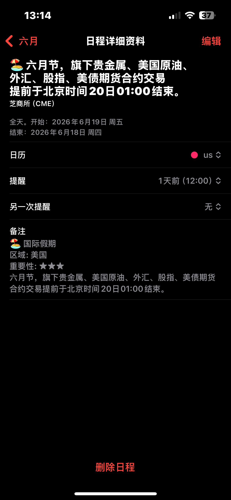
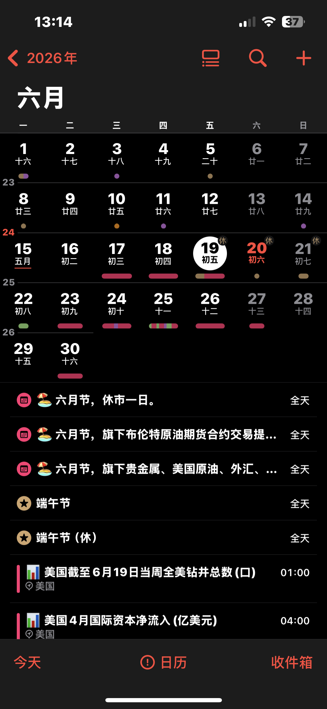

# 🗓️ 财经日历

#### 介绍
经济日历订阅服务，支持Outlook(不支持日程提醒), iCloud, Google Calendar 等日历应用。

## 主要功能

- 📅 提供重要财经数据、国际假期预告、财经大事件 
- ⏰ 数据发布前10分钟提醒
- ⌛ 15天内财经数据

## 订阅链接

> **美国_Key.ics**仅包含*假期*、*CPI*、*PPI*、*FOMC*、*GDP*、*非农*

- 中国：`https://raw.githubusercontent.com/obeya/calendar/main/中国.ics`
- 美国：`https://raw.githubusercontent.com/obeya/calendar/main/美国_Key.ics`
- 美国：`https://raw.githubusercontent.com/obeya/calendar/main/美国_High.ics`

## 如何订阅

### Apple 日历
1. 在 iPhone 上打开"设置"
2. 前往"日历" > "账户"
3. 选择"添加账户" > "添加订阅的日历"
4. 输入订阅链接

### Google 日历
1. 打开 Google Calendar
2. 点击左侧"其他日历"旁的 "+" 按钮
3. 选择"通过 URL 订阅"
4. 输入订阅链接（同上）
5. 点击"添加日历"

